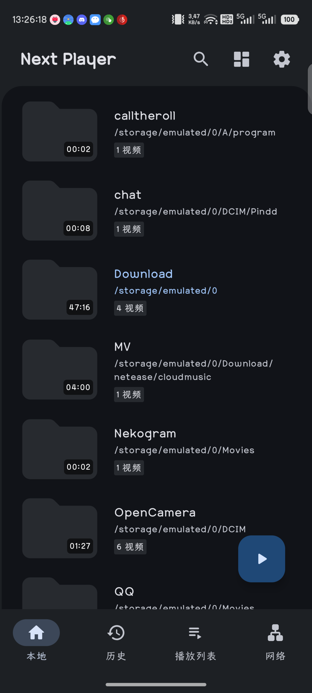
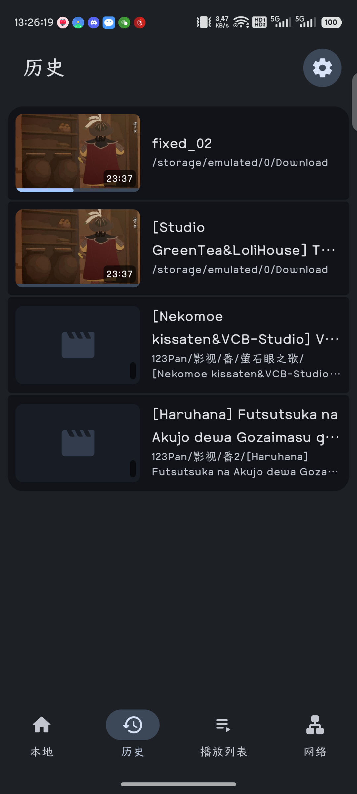
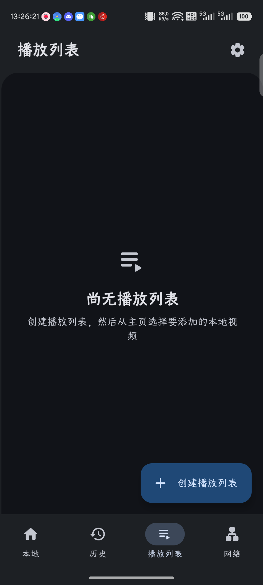
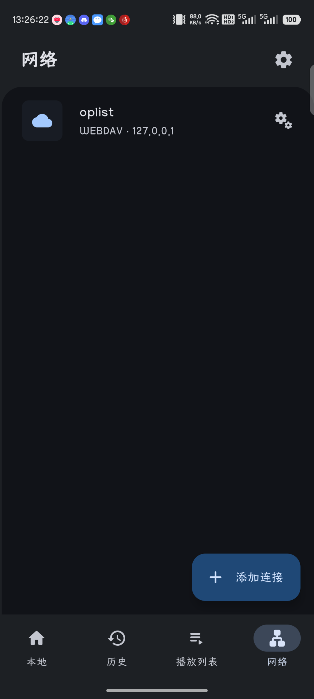

# Next Player Fork

[](https://github.com/xtnayue/nextplayer/releases/latest)
[](https://github.com/xtnayue/nextplayer/releases)
[](LICENSE)

[中文](#中文) · [English](#english)

---

## 中文

Next Player 是一款使用 Kotlin 和 Jetpack Compose 编写的 Android 原生视频播放器。本仓库是
[Anil Beesetti](https://github.com/anilbeesetti) 开发的
[Next Player 原项目](https://github.com/anilbeesetti/nextplayer)的社区 fork，在持续同步上游功能的同时，加入了字幕、播放控制、历史记录和网络媒体方面的增强。

> 本 fork 并非原作者发布的官方版本。原项目的设计、基础代码及大量持续维护工作归功于原作者和上游贡献者。
> fork 相关问题请提交到[本仓库 Issues](https://github.com/xtnayue/nextplayer/issues)，上游版本问题请前往
> [原项目 Issues](https://github.com/anilbeesetti/nextplayer/issues)。

### Fork 新增功能

- 集成 libass，改善 ASS/SSA 字幕渲染及样式兼容性。
- 支持从播放器的字幕选择界面进入视频所在的 WebDAV、FTP、SFTP 或 SMB 目录选择云端字幕。
- 新增带字幕截图、纯视频截图和可配置的逐帧前进/后退控制。
- 新增“历史”页面，按最近播放时间统一展示本地及网络视频；可配置保存条数。
- 底栏提供“本地 / 历史 / 播放列表 / 网络”入口，并可设置应用启动时默认显示的页面。
- 可分别设置播放器前向缓存和后向缓存时长。
- 对缺少索引或编码不规范的 MP4/MKV 启用恒定比特率跳转兜底，改善无法拖动进度的问题。
- 提供应用内语言选择，并补充 fork 功能的多语言资源。
- GitHub Actions 可构建 arm64-v8a、armeabi-v7a、x86 和 x86_64 APK，并支持发布 Release。
- Release 构建启用代码与资源压缩，减小 APK 体积。

### 原项目及同步的上游功能

- 原生 Material 3 界面，无广告、开源且不申请多余权限。
- 本地媒体库、搜索、树形/文件夹/文件视图及 Storage Access Framework 文件播放。
- 音轨与字幕轨选择、外部字幕、字幕延迟和播放速度控制。
- 手势调节亮度、音量、进度和画面缩放。
- 画中画、后台播放和 Android TV 支持。
- SMB、FTP、SFTP、WebDAV 网络存储播放，包括 SFTP SSH 密钥认证与主机指纹校验。
- 本地播放列表及 URL/文件形式的 M3U 播放列表。
- FFmpeg 音频扩展，以及 H.264/H.265 软件解码器。

### 支持格式

- **视频：** H.263、H.264 AVC、H.265 HEVC、MPEG-4 SP、VP8、VP9、AV1。实际硬件解码能力取决于设备。
- **音频：** Vorbis、Opus、FLAC、ALAC、PCM/WAVE、MP1、MP2、MP3、AMR、AAC、AC-3、E-AC-3、DTS、DTS-HD、TrueHD。
- **字幕：** SRT、SSA、ASS、TTML、VTT、DVB。

### 下载与构建

可从 [GitHub Releases](https://github.com/xtnayue/nextplayer/releases) 下载适合设备 ABI 的 APK。

本地构建需要 JDK 17 和 Android SDK：

```bash
./gradlew assembleDebug
```

只构建 64 位 ARM Release APK：

```bash
./gradlew 'assembleRelease-with-debug-signing' -PtargetAbi=arm64-v8a
```

---

## English

Next Player is a native Android video player written in Kotlin and Jetpack Compose. This repository is a community fork of
[the original Next Player project](https://github.com/anilbeesetti/nextplayer), created by
[Anil Beesetti](https://github.com/anilbeesetti). It follows upstream development while adding subtitle, playback-control, history, and network-media enhancements.

> This fork is not an official release by the original author. Credit for the original design, codebase, and substantial ongoing maintenance belongs to the original author and upstream contributors.
> Report fork-specific problems in [this repository's Issues](https://github.com/xtnayue/nextplayer/issues). For the upstream app, use the
> [original project's Issues](https://github.com/anilbeesetti/nextplayer/issues).

### Features added by this fork

- Integrated libass for improved ASS/SSA subtitle rendering and styling compatibility.
- A cloud-subtitle picker accessible from the player, opening the video's current WebDAV, FTP, SFTP, or SMB directory by default.
- Screenshots with subtitles, video-only screenshots, and configurable frame-forward/frame-backward controls.
- A History page combining local and network playback in chronological order, with a configurable retention limit.
- Local, History, Playlists, and Network bottom-navigation destinations, plus a configurable startup page.
- Independently configurable forward and back buffer durations.
- Constant-bitrate seeking fallback for MP4/MKV files with missing or malformed indexes.
- In-app language selection and localized resources for fork-specific features.
- GitHub Actions builds for arm64-v8a, armeabi-v7a, x86, and x86_64 APKs, with Release publishing support.
- Minified and resource-shrunk release builds for smaller APKs.

### Original and synchronized upstream features

- A native Material 3 interface that is free, open source, ad-free, and avoids excessive permissions.
- Local media library, search, tree/folder/file layouts, and Storage Access Framework playback.
- Audio and subtitle track selection, external subtitles, subtitle delay, and playback-speed controls.
- Gestures for brightness, volume, seeking, and video zoom.
- Picture-in-picture, background playback, and Android TV support.
- SMB, FTP, SFTP, and WebDAV playback, including SFTP SSH-key authentication and host-fingerprint verification.
- Local playlists and URL/file-based M3U playlists.
- FFmpeg audio extensions and software H.264/H.265 decoders.

### Supported formats

- **Video:** H.263, H.264 AVC, H.265 HEVC, MPEG-4 SP, VP8, VP9, and AV1. Hardware decoding support depends on the device.
- **Audio:** Vorbis, Opus, FLAC, ALAC, PCM/WAVE, MP1, MP2, MP3, AMR, AAC, AC-3, E-AC-3, DTS, DTS-HD, and TrueHD.
- **Subtitles:** SRT, SSA, ASS, TTML, VTT, and DVB.

### Download and build

Download an APK for your device ABI from [GitHub Releases](https://github.com/xtnayue/nextplayer/releases).

Local builds require JDK 17 and the Android SDK:

```bash
./gradlew assembleDebug
```

To build only the 64-bit ARM release APK:

```bash
./gradlew 'assembleRelease-with-debug-signing' -PtargetAbi=arm64-v8a
```

---

## Screenshots / 截图

### Phone / 手机

<div style="width:100%; display:flex; justify-content:space-between; flex-wrap:wrap; gap:8px;">

[](fastlane/metadata/android/en-US/images/phoneScreenshots/1.png)
[](fastlane/metadata/android/en-US/images/phoneScreenshots/2.png)
[](fastlane/metadata/android/en-US/images/phoneScreenshots/3.png)
[](fastlane/metadata/android/en-US/images/phoneScreenshots/4.png)
[](fastlane/metadata/android/en-US/images/phoneScreenshots/7.png)
</div>

### Player and TV / 播放器与电视

<div style="width:100%; display:flex; justify-content:space-between; flex-wrap:wrap; gap:8px;">

[](fastlane/metadata/android/en-US/images/phoneScreenshots/5.png)
[](fastlane/metadata/android/en-US/images/tvScreenshots/1.png)
[](fastlane/metadata/android/en-US/images/tvScreenshots/3.png)
</div>

## Credits / 致谢

- Original project and author / 原项目及作者：[Next Player — Anil Beesetti](https://github.com/anilbeesetti/nextplayer)
- Upstream contributors and translators / 上游贡献者与翻译人员：[Contributors](https://github.com/anilbeesetti/nextplayer/graphs/contributors)
- Fork contributors / Fork 贡献者：[Contributors](https://github.com/xtnayue/nextplayer/graphs/contributors)
- Related open-source projects include [Findroid](https://github.com/jarnedemeulemeester/findroid), [Just (Video) Player](https://github.com/moneytoo/Player), [LibreTube](https://github.com/libre-tube/LibreTube), [ReadYou](https://github.com/Ashinch/ReadYou), and [Seal](https://github.com/JunkFood02/Seal).

## License / 许可证

This fork remains licensed under the GNU General Public License v3.0. See [LICENSE](LICENSE). The copyright of upstream contributions remains with their respective authors.

本 fork 继续采用 GNU General Public License v3.0，详情见 [LICENSE](LICENSE)。上游贡献的著作权仍归各自作者所有。
