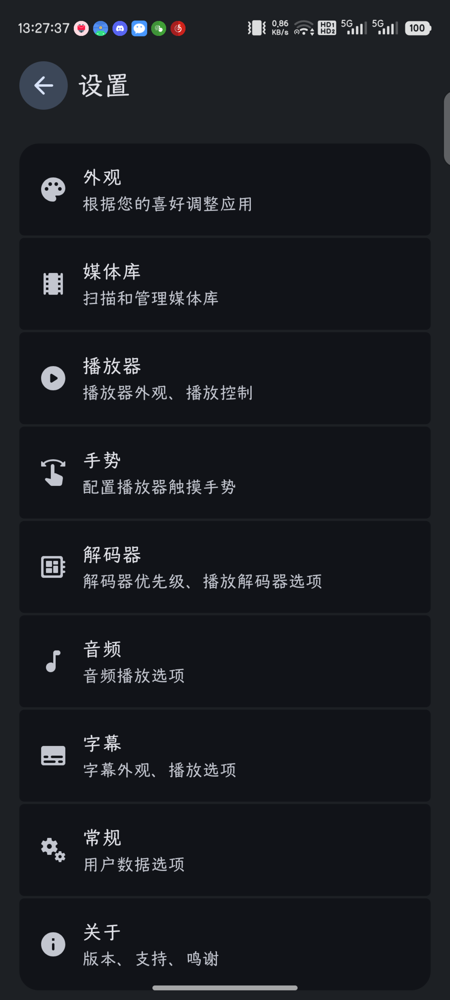

# Next Player

Next Player is an Android native video player written in Kotlin. It provides a simple and easy-to-use interface for users to play videos on their
Android devices

**This project is still in development and is expected to have bugs. Please report any bugs you find in
the [Issues](https://github.com/xtnayue/nextplayer/issues) section.**

## Screenshots

### Phone

### Player UI

### Android TV

## Supported formats

- **Video**: H.263, H.264 AVC (Baseline Profile; Main Profile on Android 6+), H.265 HEVC, MPEG-4 SP, VP8, VP9, AV1
    - Support depends on Android device
- **Audio**: Vorbis, Opus, FLAC, ALAC, PCM/WAVE (μ-law, A-law), MP1, MP2, MP3, AMR (NB, WB), AAC (LC, ELD, HE; xHE on Android 9+), AC-3, E-AC-3, DTS,
  DTS-HD, TrueHD
    - Support provided by ExoPlayer FFmpeg extension
- **Subtitles**: SRT, SSA, ASS, TTML, VTT, DVB
    - SSA/ASS has limited styling support see [this issue](https://github.com/google/ExoPlayer/issues/8435)

## Features

- Native Android app with simple and easy-to-use interface
- Completely free and open source and without any ads or excessive permissions
- Software decoders for h264 and hevc
- Audio/Subtitle track selection
- Vertical swipe to change brightness (left) / volume (right)
- Horizontal swipe to seek through video
- [Material 3 (You)](https://m3.material.io/) support
- Media picker with tree, folder and file view modes
- Play videos from url
- Play videos from storage access framework (Android Document picker)
- Control playback speed
- External Subtitle support
- Zoom gesture
- Picture-in-picture mode
- Background playback
- Android TV version
- Search Functionality
- Subtitle delay
- Network storage support (SMB/FTP/SFTP/WebDAV)

## Planned Features

- External Audio support
- Online subtitles download

## Contributing

Contributions are welcome!

## Credits

### Open Source Projects

- [Findroid](https://github.com/jarnedemeulemeester/findroid)
- [Just (Video) Player](https://github.com/moneytoo/Player)
- [LibreTube](https://github.com/libre-tube/LibreTube)
- [ReadYou](https://github.com/Ashinch/ReadYou)
- [Seal](https://github.com/JunkFood02/Seal)
- ...

## License

Next Player is licensed under the GNU General Public License v3.0. See the [LICENSE](LICENSE) file for more information.
